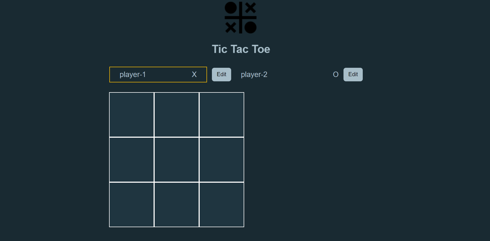
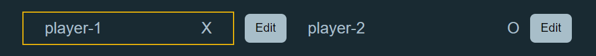
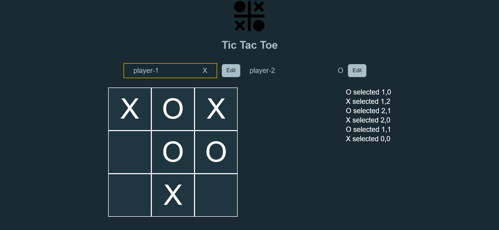
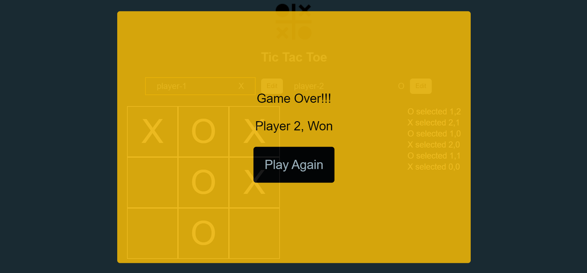

# Tic Tac Toe Game

## Table of Content

 * [Overview of the Project](#overview-of-the-project)
 * [Whats New](#whats-new)
 * [Whats The Approach](#whats-the-approach)
 * [Technologies I Used](#technologies-i-used)
 * [Screenshot](#screenshot)
 
 
# Overview of the Project

A tic tac toe game which is a update from the old project I made using JavaScript. This time I made it using React + TypeScript using Tailwind CSS. 

## Whats New

1. Earlier I just made the project using JavaScript and CSS in which I only made the game Board and displayed the winner.

2. This Time I updated the tech stack and made it using React + TypeScript and used Tailwind CSS and updated the styling for it.

3. I also added a log table to show the player moves each player is playing and added a game over screen to show the winner or if its a draw.

4. I also added a name input functionality to add your name and opponent's name.

## Whats The Approach

1. The Approach was simple first I created the name input functionality to add the player's name and opponents name and edit the name too.

2. I also added a small styling where I highlighted which player turn it is.

3. Now I created the game board which was simple but the main challenge was to create log table to display each user moves alongside. Its a challenge because the gameboard and log table will use the same state and components which will lead to creating that same state in a different component which is unnecessary, so to avoid that problem i created the gameboard state in the app component and pass the values down as props which will reduce state and help in state management.

4. Now when the game finishes a game over screen will be displayed which shows which player won or if its a draw. 

## Technologies I Used

* React
* TypeScript
* Tailwind CSS

## Screenshot

